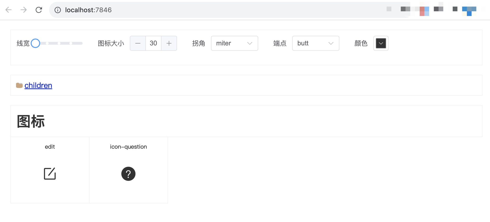

# svg-preview

Preview all svg in one page.

<br>

<pre>
npm i <b>svg-preview-pro</b> --global
</pre>


<br>


### `Usage`

```bash
svg-preview
```
<pre>
open http://localhost:7846
</pre>




## License

[MIT](LICENSE)
